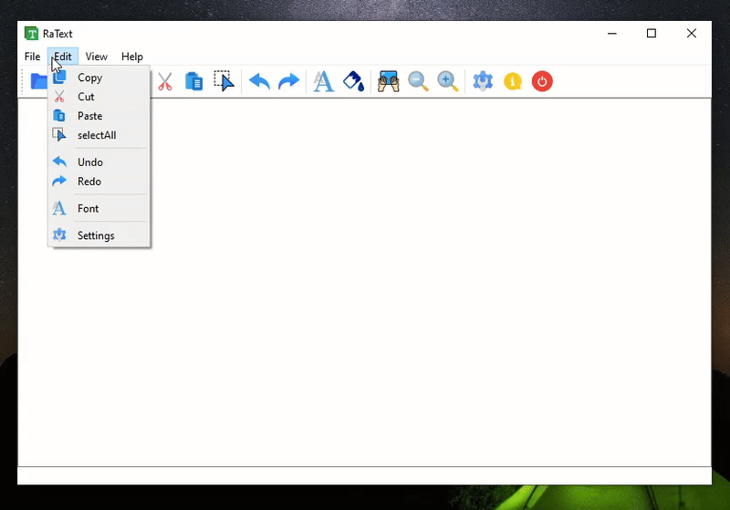

# RaTex Text Editor (Qt)

**RaTex** is a personal **C++/Qt project** demonstrating GUI design, rich text editing, and advanced user interaction.

## Screenshot

## Key Features
- Custom text editor with **dynamic transparency** and modular GUI
- Rich text formatting (font, color, style) with **undo/redo support**
- Multi-format export (TXT, PDF, A3/A4) with configurable settings
- Interactive **menu, toolbar, and status bar** customization
- File handling (open/save) with robust input/output management

## Additional Features
- Configurable editor tools and view options
- Dynamic theme and transparency adjustment
- Full clipboard support (copy, cut, paste)

## Tech Stack
- C++17
- Qt 6.7.3 (Widgets, GUI, File IO)
- Qt Creator 14.0.2 (MSVC 2019, x86_64)
