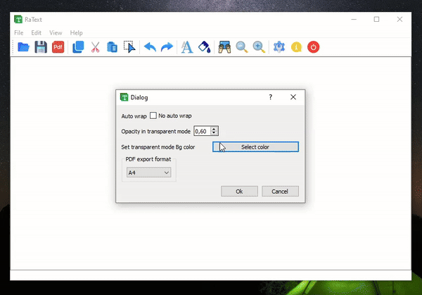

# RaTex Text Editor (Qt)

**RaTex** is a multi-document rich text editor built with **C++17 and Qt 6**.

This project was developed to strengthen my expertise in Qt Widgets, document state management, and clean desktop application architecture.

---

##  Demo

---

##  Core Features

-  Multi-document interface using `QTabWidget`
-  Rich text formatting (fonts, colors, styles)
-  Per-tab background customization
-  Dynamic transparency mode
-  Full undo / redo support
-  Zoom in / zoom out
-  Open / Save (TXT)
-  Export to PDF (A3 / A4 support, formatting preserved)
-  Export to Html file type.
-  Unsaved changes detection with confirmation dialog
-  Clipboard support (copy / cut / paste)

---

## Technical Highlights

- Independent `QTextEdit` instance per tab
- Document state tracking via `QTextDocument::isModified()`
- Encapsulation of per-document visual configuration
- Event-driven design using Qt signal/slot mechanism
- Modular UI structure (menu bar, tool bar, status bar separation)
- RAII-based memory management (no raw ownership leaks)

---

##  Architecture Overview

The application is structured around:

- `MainWindow` → UI orchestration & global actions
- `Document Tab` abstraction → encapsulates per-document state
- `Settings window` grab document settings from user input. 
- Document lifecycle management (creation, save, close validation)

Each tab maintains:
- Its own text document
- Its own background configuration
- Its own modification tracking
- Independent export configuration

This ensures isolation between documents and predictable behavior across multiple open files.

---

## Tech Stack

- C++17
- Qt 6.7.3 (Widgets, GUI, File I/O, QPrinter)
- MSVC 2019 (x86_64)

---

##  Future Improvements

- Auto-save mechanism
- Persistent theme profiles
- MVC refactoring for stricter separation of concerns
- Unit testing (Qt Test or Catch2)
- Markdown support

---

##  Project Goal

RaTex was built as part of my progression toward advanced C++/Qt desktop development, with focus on:

- Clean architecture
- Robust document lifecycle management
- Maintainable GUI design
- Modern C++ best practices
